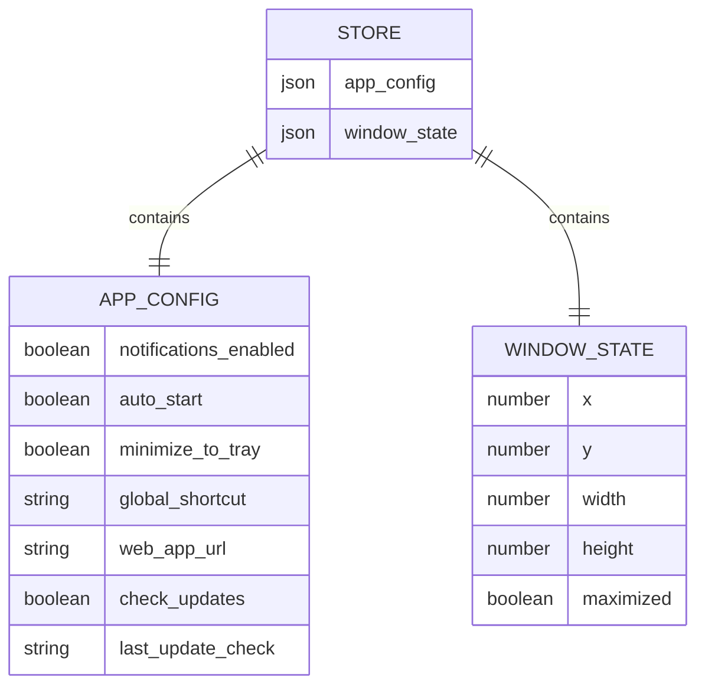

# Database Detailed Design

## Note on Storage

This desktop app has **no traditional database**. All chat data lives in Supabase (managed by the web app). The desktop shell only persists local preferences via Tauri's `plugin-store`, which writes a JSON file to the OS-specific app data directory.

**Storage location per OS:**
- macOS: `~/Library/Application Support/com.agent-playground.desktop/store.json`
- Windows: `%APPDATA%/com.agent-playground.desktop/store.json`
- Linux: `~/.config/com.agent-playground.desktop/store.json`

## 1. Data Model Diagram



## 2. Entity Definitions

### E-01: AppConfig

**Store key:** `app_config`
**Purpose:** User preferences for desktop app behavior.

| Field | Type | Default | Nullable | Description | FR |
|-------|------|---------|----------|-------------|----|
| notifications_enabled | boolean | `true` | No | Show native OS notifications for new messages | FR-06 |
| auto_start | boolean | `false` | No | Launch app on OS login | FR-08 |
| minimize_to_tray | boolean | `true` | No | Close button minimizes to tray instead of quit | FR-03 |
| global_shortcut | string | `"CmdOrCtrl+Shift+A"` | No | System-wide hotkey to toggle window | FR-09 |
| web_app_url | string | `""` | No | Agent Playground deployment URL. Empty = use build-time default from env. | FR-01 |
| check_updates | boolean | `true` | No | Auto-check for new versions | FR-12 |
| last_update_check | string | `null` | Yes | ISO 8601 timestamp of last update check | FR-12 |

**Example JSON:**
```json
{
  "notifications_enabled": true,
  "auto_start": false,
  "minimize_to_tray": true,
  "global_shortcut": "CmdOrCtrl+Shift+A",
  "web_app_url": "",
  "check_updates": true,
  "last_update_check": "2026-03-17T10:30:00Z"
}
```

**Validation rules:**
- `global_shortcut`: Must be a valid Tauri accelerator string (e.g., `CmdOrCtrl+Shift+<Key>`)
- `web_app_url`: Must be empty string (use default) or valid HTTPS URL
- `last_update_check`: Must be null or valid ISO 8601 string

---

### E-02: WindowState

**Store key:** `window_state`
**Purpose:** Persist window geometry across sessions.

| Field | Type | Default | Nullable | Description | FR |
|-------|------|---------|----------|-------------|----|
| x | number | `null` | Yes | Window X position in pixels. Null = OS default center. | FR-07 |
| y | number | `null` | Yes | Window Y position in pixels. Null = OS default center. | FR-07 |
| width | number | `1200` | No | Window width in pixels. Min: 800. | FR-07 |
| height | number | `800` | No | Window height in pixels. Min: 600. | FR-07 |
| maximized | boolean | `false` | No | Whether window was maximized when last closed | FR-07 |

**Example JSON:**
```json
{
  "x": 100,
  "y": 50,
  "width": 1400,
  "height": 900,
  "maximized": false
}
```

**Validation rules:**
- `width`: Min 800, max screen width
- `height`: Min 600, max screen height
- `x`, `y`: Must place window within visible screen bounds (handle monitor disconnect)

## 3. Store File Structure

The `plugin-store` persists all data in a single JSON file:

```json
{
  "app_config": {
    "notifications_enabled": true,
    "auto_start": false,
    "minimize_to_tray": true,
    "global_shortcut": "CmdOrCtrl+Shift+A",
    "web_app_url": "",
    "check_updates": true,
    "last_update_check": null
  },
  "window_state": {
    "x": null,
    "y": null,
    "width": 1200,
    "height": 800,
    "maximized": false
  }
}
```

## 4. Data Lifecycle

| Event | Action | Entity |
|-------|--------|--------|
| First launch | Create store with all defaults | E-01, E-02 |
| Window move/resize | Save position + size (debounced 500ms) | E-02 |
| Window close | Save final state before hide | E-02 |
| Tray menu toggle | Update preference, persist immediately | E-01 |
| Update check complete | Update `last_update_check` timestamp | E-01 |
| App quit | Ensure store is flushed to disk | E-01, E-02 |

## 5. Migration Strategy

Since this is a JSON key-value store (not a database), schema changes are handled via **version key + migration on load**:

```json
{
  "schema_version": 1,
  "app_config": { ... },
  "window_state": { ... }
}
```

**On app startup:**
1. Read `schema_version` from store
2. If missing or < current version, run migrations sequentially
3. Each migration transforms the JSON in-place
4. Write updated `schema_version`

**Example migration (v1 → v2):**
- Add new field with default: `app_config.some_new_field = "default"`
- Rename field: copy old → new, delete old
- Never delete user data without explicit action

## 6. Traceability Matrix

| Entity | Fields | FR Coverage |
|--------|--------|-------------|
| E-01 AppConfig | notifications_enabled | FR-06 |
| E-01 AppConfig | auto_start | FR-08 |
| E-01 AppConfig | minimize_to_tray | FR-03 |
| E-01 AppConfig | global_shortcut | FR-09 |
| E-01 AppConfig | web_app_url | FR-01 |
| E-01 AppConfig | check_updates, last_update_check | FR-12 |
| E-02 WindowState | x, y, width, height, maximized | FR-07 |
