# System Architecture

**Version:** 0.2.0 | **Updated:** 2026-03-19

## 1. High-Level Architecture

```mermaid
graph TB
    subgraph Desktop["Tauri v2 Desktop Shell (Rust)"]
        Window["System Window<br/>(Webview)"]
        Tray["System Tray<br/>+ Menu"]
        Bridge["JS Bridge<br/>(Initialization Script)"]
        Store["Local Store<br/>(JSON)"]
        Notif["Notification Engine<br/>(Plugin)"]
        Shortcuts["Global Shortcuts<br/>(Plugin)"]
        Updater["Auto-Updater<br/>(Plugin)"]
    end

    subgraph Frontend["Web App (Remote)"]
        Chat["Chat UI<br/>(Next.js)"]
        Realtime["Realtime Listener<br/>(Supabase)"]
    end

    subgraph Backend["Backend Services"]
        Supabase["Supabase<br/>(Auth + DB)"]
    end

    Window -->|Page Load| Chat
    Chat -->|Custom Events| Bridge
    Bridge -->|IPC invoke()| Desktop
    Bridge -->|JS→Rust Commands| Store
    Bridge -->|JS→Rust Commands| Notif
    Realtime -->|Message Events| Chat
    Chat -->|notify event| Bridge
    Bridge -->|notify_new_message| Notif
    Tray -->|toggle_window| Window
    Shortcuts -->|Global Hotkey| Window
    Updater -->|Check Releases| Backend
    Store -->|Persist Config| Desktop
    Supabase -->|Authenticate| Chat
```

**Key Characteristics:**
- Remote URL loading (no bundled web app)
- Event-driven notification bridge (web app → desktop)
- Single window with minimize-to-tray
- Persistent state via local JSON store
- Background auto-update checking

## 2. Data Flow Diagram

### 2.1 New Message Notification Flow

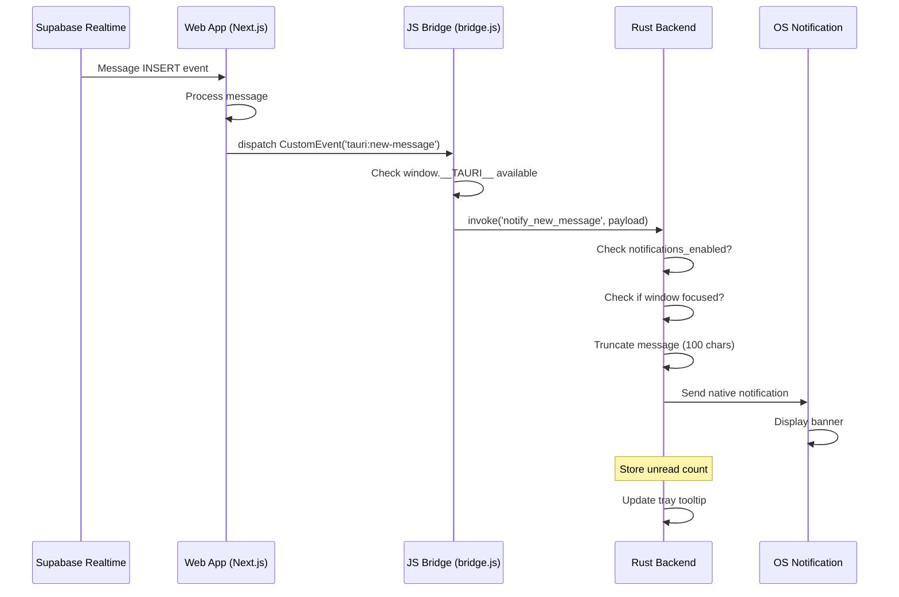

**Latency targets:**
- Supabase → WebApp: <100ms
- WebApp dispatch: <50ms
- Bridge invoke: <50ms
- Notification display: <300ms
- **Total: <500ms**

### 2.2 Window Persistence Flow

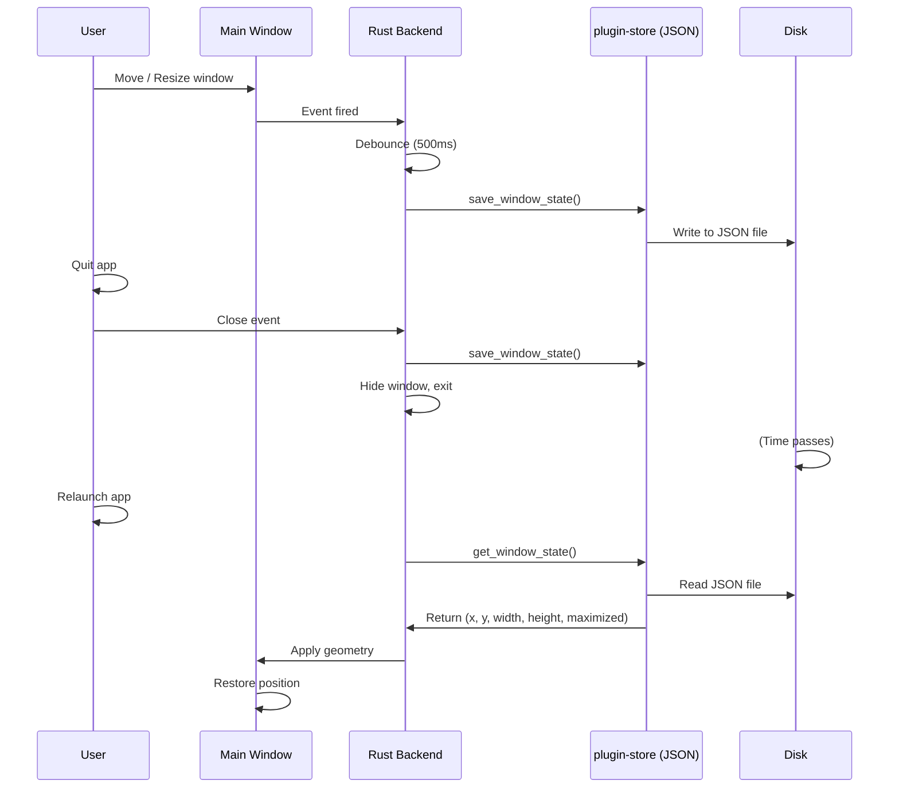

**State elements persisted:**
- x, y: window position
- width, height: window size
- maximized: boolean flag

## 3. Component Architecture

### 3.1 Rust Backend Modules

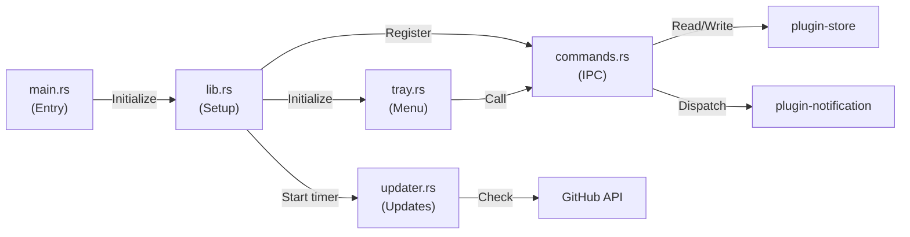

**Module responsibilities:**

| Module | LOC | Responsibility |
|--------|-----|-----------------|
| main.rs | 6 | Entry point, delegates to lib |
| lib.rs | 136 | App setup, window creation, bridge injection, event loop |
| commands.rs | 230 | 5 IPC commands, data struct definitions, store integration |
| tray.rs | 106 | System tray menu, visibility toggle, notification toggle |
| updater.rs | 98 | Background update checks, version comparison, download |

### 3.2 Frontend Stack

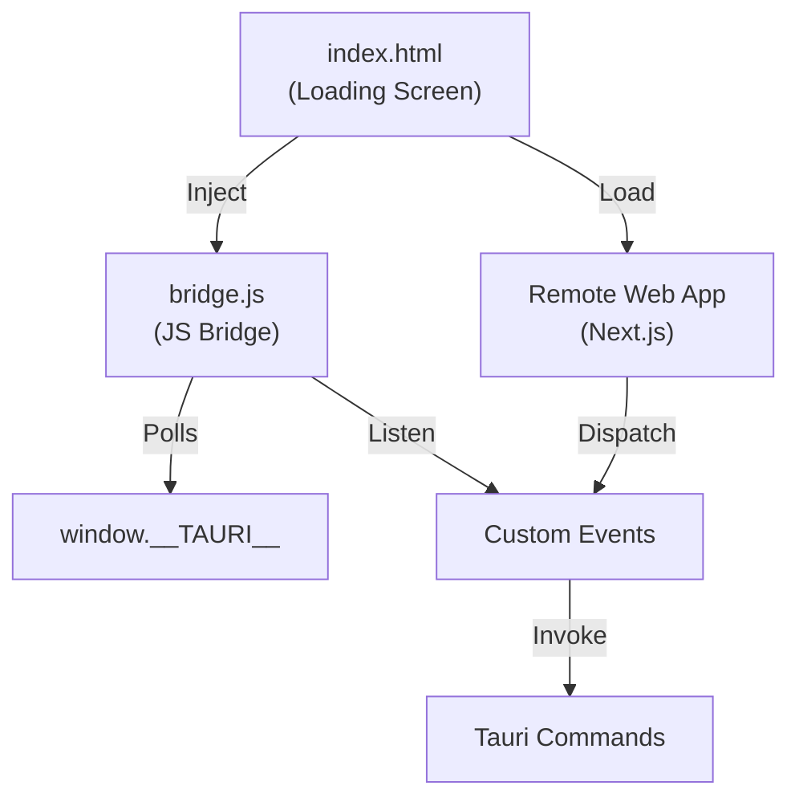

**Frontend files:**
- **index.html** (37 lines): Loading spinner, light/dark mode CSS, minimal JS to hide on page load
- **bridge.js** (71 lines): Polls for __TAURI__, listens for 3 custom events, forwards to IPC

## 4. IPC Command Architecture

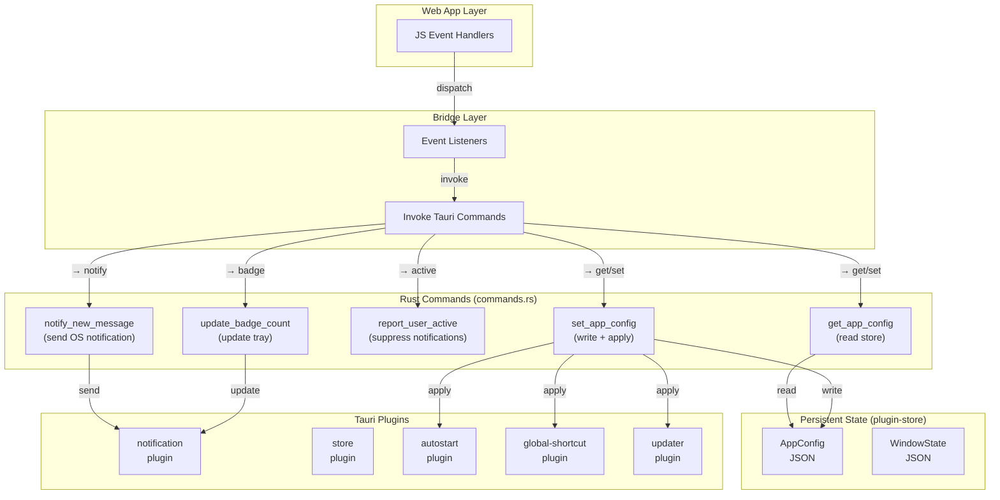

**Command flow:** JS Event → JS Bridge → Tauri Invoke → Rust Command → Plugin API → Side effects

## 5. Plugin Dependency Map

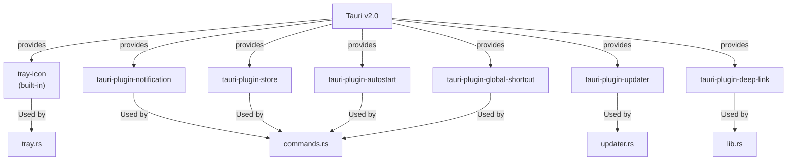

## 6. Configuration & Capability Architecture

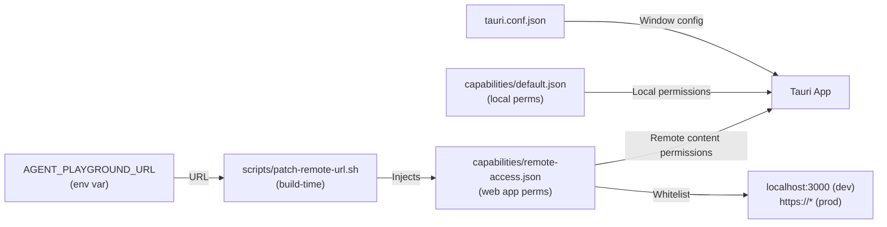

**Key principle:** Production URL patched at build time to avoid hardcoding credentials.

## 7. State Machine Diagrams

### 7.1 Window Visibility State

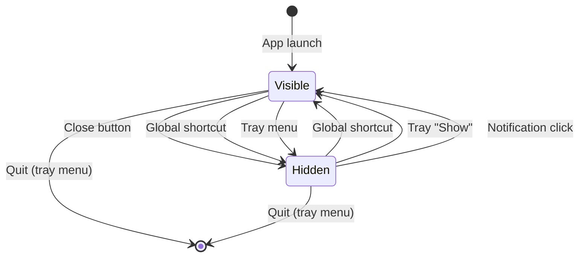

### 7.2 Update Check State Machine

```mermaid
stateDiagram-v2
    [*] --> Idle

    Idle -->|App startup| Checking: Start check timer
    Idle -->|User clicks "Check Updates"| Checking: Manual check

    Checking -->|Success| Available: New version found
    Checking -->|No update| Idle: Same version
    Checking -->|Network error| Idle: Log error, retry later

    Available -->|User "Install Now"| Downloading: Start download
    Available -->|User "Later"| Idle: Dismiss dialog

    Downloading -->|Success| Installed: Restart app
    Downloading -->|Failure| Idle: Log error

    Installed --> [*]: App restarts
```

## 8. Notification Architecture

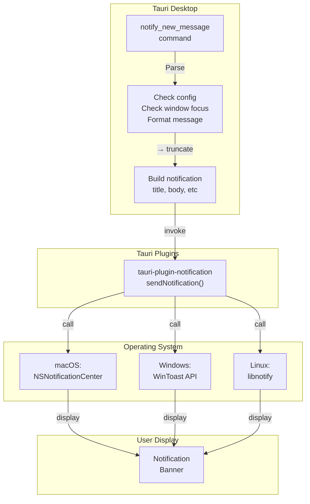

**Notification lifecycle:**
1. Web app detects new message via Supabase Realtime
2. Dispatches `tauri:new-message` custom event
3. JS bridge invokes `notify_new_message` command
4. Rust checks: enabled? window focused?
5. Formats (truncate to 100 chars, add "...")
6. Sends to OS via plugin
7. OS displays banner
8. User clicks → navigates webview to conversation

## 9. File I/O Diagram

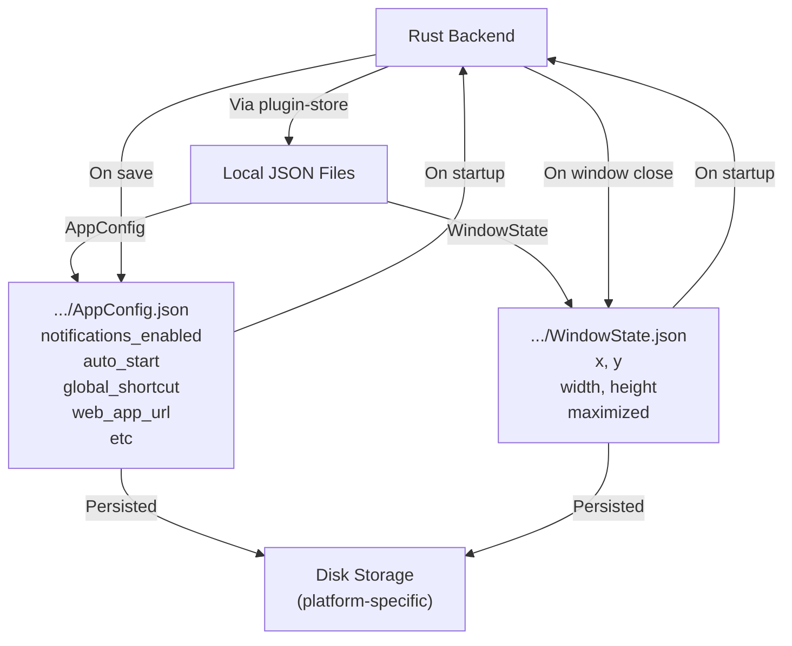

**Storage locations (platform-specific):**
- macOS: ~/Library/Application Support/com.agent-playground.desktop/
- Windows: %AppData%/com.agent-playground.desktop/
- Linux: ~/.config/com.agent-playground.desktop/

## 10. Release & Update Architecture

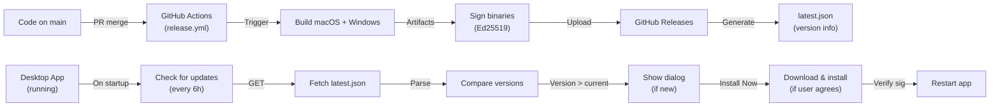

## 11. Security Architecture

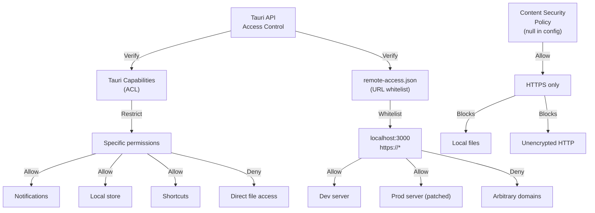

**Defense layers:**
1. Tauri capabilities (ACL) restrict which commands JS can invoke
2. remote-access.json whitelist restricts which URLs get API access
3. HTTPS enforcement (CSP null allows all, but relies on HTTPS requirement)
4. Ed25519 signature verification for updates

## 12. Deployment Architecture

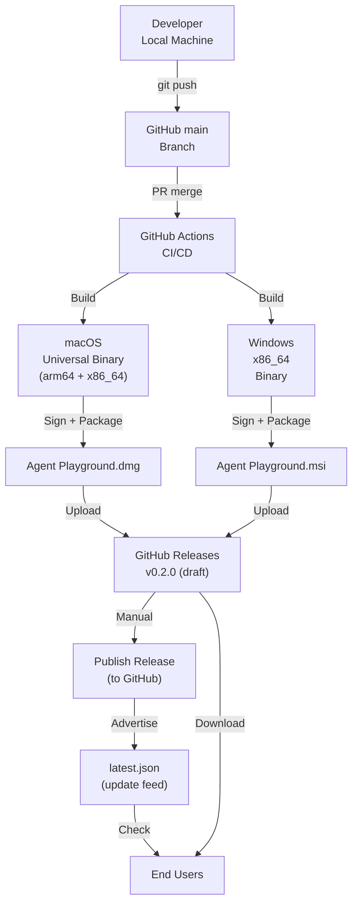

**Key workflow:**
1. Developer pushes code to main
2. GitHub Actions automatically builds macOS + Windows
3. Artifacts uploaded to GitHub Releases (draft)
4. Manual publish converts draft to public
5. End users see update via latest.json feed

---

**Architecture Principles:**
- **Separation of concerns:** Rust (system) vs JS (UI)
- **Event-driven:** Custom events connect web app to desktop
- **Graceful degradation:** Config errors logged, sensible defaults used
- **Minimal persistence:** Only state that can't be recomputed (geometry, preferences)
- **Platform-native:** Leverage OS APIs (notifications, tray, shortcuts), not custom solutions
